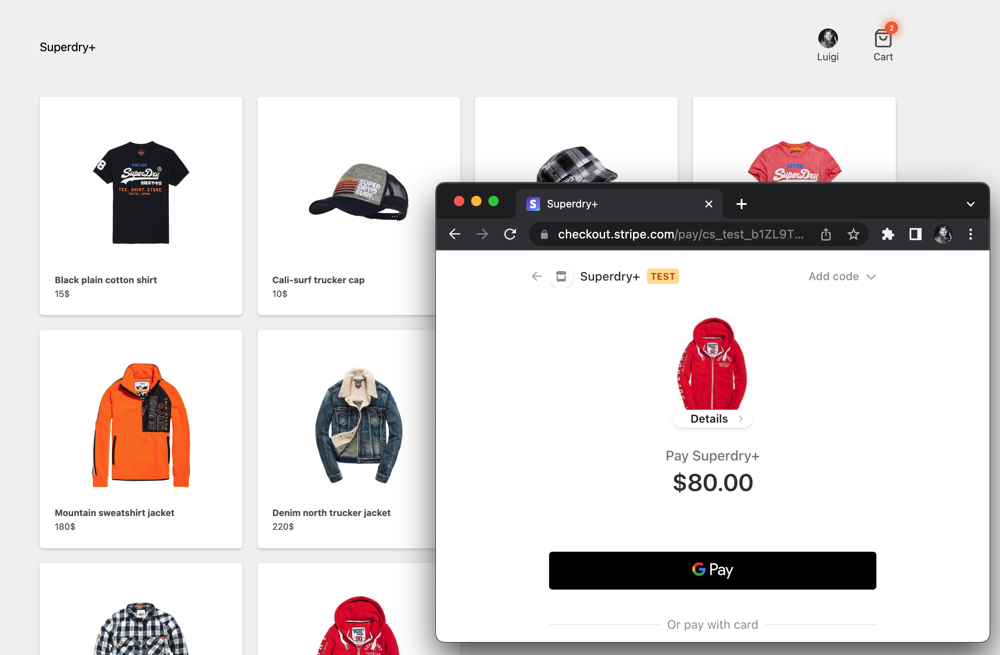

## Superdry+

> An online, fullstack app, e-commerce store, example. 🥳

Featuring:

- This is a [Next.js](https://nextjs.org/) project bootstrapped with [`create-next-app`](https://github.com/vercel/next.js/tree/canary/packages/create-next-app).
- Open [https://superdryclone.netlify.app/](https://superdryclone.netlify.app/) with your browser to see the result.
- The store is using a heroku hosted [https://guarded-retreat-19317.herokuapp.com/api/products](strapi) backend.
- Images are optimized via [cloudinary.com](cloudinary.com).
- Authentication is done via [auth0.com](auth0.com) and the needed SDK's for next.
- Lastly it has a testing [dashboard.stripe.com](stripe.com) integration.

Regards,  
Luigi Lupini  
 
I ❤️ all things (🇮🇹 / 🛵 / ☕️ / 👨‍👩‍👧) 
